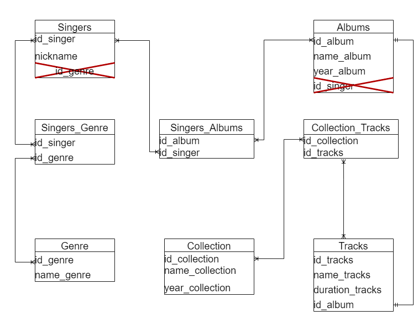

## Flowchart

 

## SQL commands

```sql
ALTER TABLE Albums
DROP COLUMN IF EXISTS id_singer;

ALTER TABLE Singers
DROP COLUMN IF EXISTS id_genre;

CREATE TABLE IF NOT EXISTS Collection (
	id_collection SERIAL PRIMARY KEY NOT NULL,
	name_collection VARCHAR(100) NOT NULL,
	year_collection INTEGER NOT NULL
);

CREATE TABLE IF NOT EXISTS Singers_Genre (
	id_singer INTEGER NOT NULL REFERENCES Singers(id_singer),
	id_genre INTEGER NOT NULL REFERENCES Genre(id_genre)	
);

CREATE TABLE IF NOT EXISTS Singers_Albums (
	id_album INTEGER NOT NULL REFERENCES Albums(id_album),
	id_singer INTEGER NOT NULL REFERENCES Singers(id_singer)
);

CREATE TABLE Collection_tracks (
	id_collection INTEGER NOT NULL REFERENCES Collection(id_collection),
	id_tracks INTEGER NOT NULL REFERENCES Tracks(id_tracks)
);
```